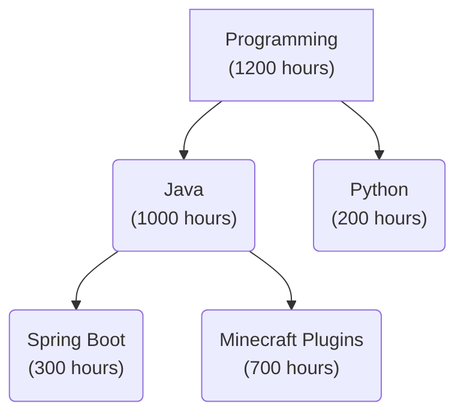

# Djed Next

This repository contains the web application for Djed, a productivity app built with Next.js and TypeScript.

---

## What is Djed?

Djed is a productivity application designed for people like me, who have difficulty committing time to learning things that don't have a clear path of progression.

Djed organizes learning into **skills**, **skill trees**, **milestones**, and **time-tracking sessions**, allowing users to see their progress as they work toward larger goals.

---

## Components of Djed

### Skill

A skill is the fundamental component of Djed. It has a name, a description, and an accumulated time.

Skills can be organized hierarchically, allowing one skill to be a parent of another. A skill's total time includes the time spent directly on that skill as well as the time spent on all of its child skills.

### Skill Tree

A skill tree is the primary way of organizing skills. Each skill tree begins with a root skill, which represents the overall subject and tracks the combined time spent throughout the entire tree.

*In this example, "Programming" is the root skill, and tracks the overall time spent in each child skill.*

### Milestones

A milestone is a time-based goal assigned to a skill.

For example, a Java skill could have a milestone of 500 hours. As time is logged against the skill, progress toward the milestone can be tracked.

### Time Tracking

Time in Djed is tracked using sessions.

A session consists of a start time, an end time, and the skill being worked on. The time recorded by a session contributes to the total time of that skill and is also propagated to its parent skills.

For example, a 2-hour Spring Boot session contributes:

- **2 hours** to Spring Boot
- **2 hours** to Java
- **2 hours** to Programming

This allows parent skills to automatically represent the total amount of time invested in their entire subtree.

---

## About This Rewrite

This is a rewrite of the original Spring Boot and PostgreSQL backend as a full-stack Next.js application. The core concepts above are unchanged; only the implementation is different.